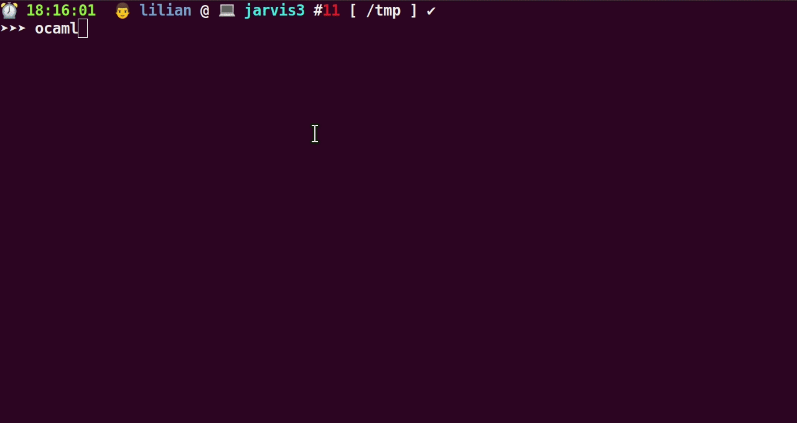
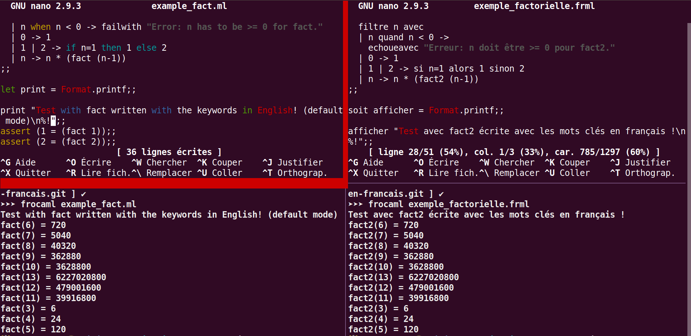
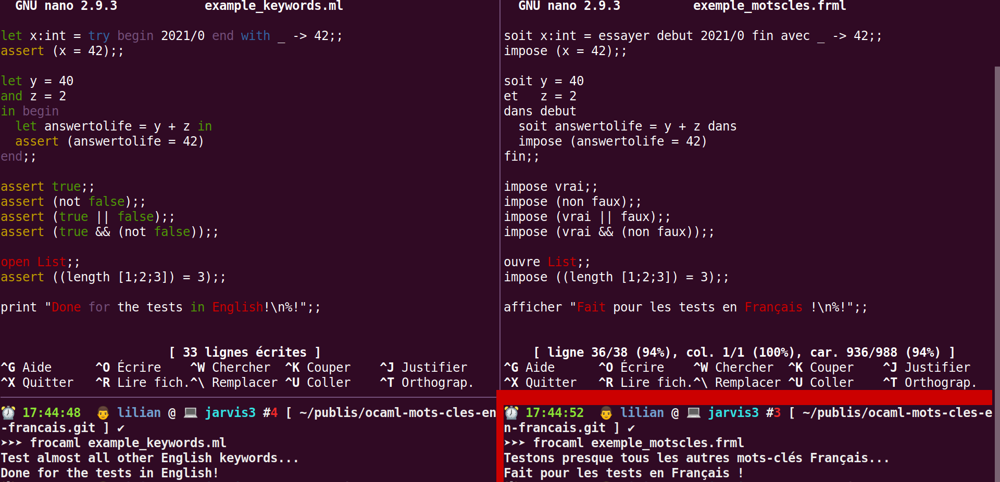

# Petite expérience sur le code source de OCaml

> Voir cette discussion en anglais : <https://discuss.ocaml.org/t/what-files-to-modify-in-ocaml-ocaml-source-code-to-have-a-parser-accepting-keywords-in-french-traduire-mots-cles-en-francais/7400/3>.
> Si besoin, voir [le code source de OCaml](https://GitHub.com/OCaml/OCaml), dont ce dossier est une minuscule bifurcation ("fork") avec juste quelques lignes modifiées.

## Objectifs

À des fins pédagogiques, j'ai voulu modifier une version locale du code source de [@ocaml/ocaml](https://GitHub.com/OCaml/OCaml), et changer l'analyseur lexicale pour pouvoir recompiler OCaml, afin que ses programmes `ocaml` (le "toplevel", et les deux compilateurs `ocamlc` et `ocamlopt`) **acceptent de lire le code OCaml où (certains) des mots-clés sont traduits en français**.

Par exemple, j'aimerais pouvoir lire et exécuter (ou compiler) un petit programme comme celui-ci :

```ocaml
soit recursive factorielle (n : entier) =
    filtrer n avec
    | n quand n < 0 -> echoueavec "Erreur : n doit être >= 0 pour factorielle."
    | 0 -> 1
    | n -> n * (factorielle (n-1))
;;
```

Qui est la version "francisée" du (vrai) code OCaml suivant :

```ocaml
let rec fact (n : int) =
    match n with
    | n when n < 0 -> failwith "Error: n has to be >= 0 for fact."
    | 0 -> 1
    | n -> n * (fact (n-1))
;;
```

Vous remarquerez que la coloration syntaxique du premier code ne détecte pas les mots clés traduits en français, et c'est normal.
Mais par contre, avec quelques petites modifications, on arrive à recompiler l'ensemble des programmes OCaml (`ocaml`, `ocamlc` etc) pour qu'ils acceptent cette syntaxe étendue et "traduite".
Ce n'est pas si compliqué, cf les explications plus bas !

### Démonstration intéractive



> Avec [ce script `frocaml`](frocaml).

---

## Traduction des mots clés

La table ci-dessous précise la traduction de tous les mots clés *usuels* de OCaml.

| Anglais  |  *Français*         |
|:---------|:--------------------|
| `and`    | `et`                |
| `assert` | `impose`            |
| `begin`  | `debut`             |
| `do`     | `faire`             |
| `done`   | `fait`              |
| `downto` | `jusquadecroissant` |
| `else`   | `sinon`             |
| `end`    | `fin`               |
| `false`  | `faux`              |
| `for`    | `pour`              |
| `if`     | `si`                |
| `in`     | `dans`              |
| `let`    | `soit`              |
| `match`  | `filtre`            |
| `open`   | `ouvre`             |
| `or`     | `ou`                |
| `rec`    | `recursif`          |
| `then`   | `alors`             |
| `to`     | `jusqua`            |
| `true`   | `vrai`              |
| `try`    | `essayer`           |
| `when`   | `quand`             |
| `while`  | `tantque`           |
| `with`   | `avec`              |

*Quelques remarques :*

- Il n'y a pas d'accent, et pas d'espace ni guillemet dans les mots clés, notamment `debut`, `jusqua` et `jusquadecroissant` sont un peu moches. On devrait pouvoir ajouter les accents, mais pas les espaces ni les guillemets. J'ai voulu faire simple et rapide !
- Je n'ai pas visé à traduire tous les mots clés, seulement ceux que j'utilise en général.
- Notamment, aucune des fonctionnalités orientées *objet* (le **O** de OCaml) n'ont été traduites - je ne m'en suis jamais servi depuis 2013.
- Je me suis inspiré des conventions de nommage de [Chamelle](http://gallium.inria.fr/blog/ocaml-5/), mais pas de leur code (qui avait 6 ans et ne compilait plus chez moi).

---

## Exemples

Dans ces deux fichiers en OCaml normal, avec les mots clés en anglais, avec l'extension `.ml`, se trouvent des tests :

- [`example_fact.ml`](example_fact.ml) définit une fonction factorielle récursive et affiche plusieurs valeurs, avec des boucles `for` et `while` ;
- [`example_keywords.ml`](example_keywords.ml) fait plein de petits tests, pour utiliser tous les mots clés différents du langage.

Et dans les deux fichiers avec l'extension `.frml` (choisie pour s'amuser, elle ne sera pas reconnue par votre système d'exploitation, ou votre éditeur) :

- [`exemple_factorielle.frml`](exemple_factorielle.frml) définit une fonction factorielle récursive et affiche plusieurs valeurs, avec des boucles `pour` et `tantque` ;
- [`exemple_motscles.frml`](exemple_motscles.frml) fait plein de petits tests, pour utiliser tous les mots clés différents du langage.

### Tests avec la factorielle



### Tests avec tous les mots clés



---

## Modifications à faire pour obtenir cela

> - Ces modifications ont été faites le 03 mars 2021, [au commit `8b8168ee0`](https://github.com/Naereen/ocaml-mots-cles-en-francais/commit/8b8168ee0), avec OCaml version `4.13.0+dev0-2020-10-19`.
> - Ces modifications ont marchés *sur ma machine* (Ubuntu 18.03), avec le compilateur `gcc (Ubuntu 7.5.0-3ubuntu1~18.04) 7.5.0`, et n'ont aucune raison de fonctionner sur d'autres machines.
> - :warning: Je ne vais PAS maintenir ce dépôt, c'était juste pour une expérience !

Pour reproduire cette expérience chez vous, il vous faut : un ordinateur sous GNU/Linux (Ubuntu c'est très bien), avec `gcc`, `git` et `GNU Make`.

```bash
cd ~/un/sous/dossier/qui/va/bien/
git clone https://github.com/Naereen/ocaml-mots-cles-en-francais/
cd ocaml-mots-cles-en-francais/ocaml-sources/
./configure --prefix=/home/nomutilisateur/un/sous/dossier/qui/va/bien/ocaml-mots-cles-en-francais/
```

Soyez bien prudent et choisissez un dossier **local** et pas votre `/usr/` ou `/usr/local/`, dans l'appel à `./configure`, pour être sûr de ne pas aller polluer votre installation globale de OCaml avec ces nouveaux binaires "polyglottes".

Ensuite, voici un aperçu des modifications à effectuer dans le fichier [`parser/lexer.mll`], qui contrôle le lexer (analyse lexicale) de tout le reste des binaires OCaml :

1. augmenter la taille `let keyword_table = create_hashtable 181` : on peut augmenter de beaucoup sans risque ;
2. pour chaque mot clé que l'on souhaite traduire, il suffit d'ajouter une ligne avec sa traduction : (voir [ce commit : `cc2feb0a5`](https://github.com/Naereen/ocaml-mots-cles-en-francais/commit/cc2feb0a5)).

```diff
 diff --git a/parsing/lexer.mll b/parsing/lexer.mll
 index 89d687630..fe1cad73e 100644
 --- a/parsing/lexer.mll
 +++ b/parsing/lexer.mll
 @@ -38,57 +38,88 @@ exception Error of error * Location.t;;
  (* The table of keywords *)

  let keyword_table =
 -  create_hashtable 149 [
 +  create_hashtable 181 [
    "and", AND;
+      "et", AND;  (* DONE: French by @Naereen *)
    "assert", ASSERT;
+    "impose", ASSERT;  (* DONE: French by @Naereen *)
```

3. ensuite, lors de la recompilation de l'ensemble (avec un simple `make`, précédé d'un premier appel à `./configure`), vous aurez quelques erreurs parce que certains mots clés français comme `et`, `de`, `si` sont utilisés à quelques endroits de certains fichiers. Ma solution a été naïve mais efficace : renommer ces noms de variables, en `ettt`, `deee` et `siii` (voir [ce commit : `3dd32d17b`](https://github.com/Naereen/ocaml-mots-cles-en-francais/commit/3dd32d17b)) ;

```diff
diff --git a/asmcomp/split.ml b/asmcomp/split.ml
index 55fe38c34..931537737 100644
--- a/asmcomp/split.ml
+++ b/asmcomp/split.ml
@@ -100,12 +100,12 @@ let merge_subst_array subv instr =
     if i >= Array.length subv then None else begin
       match subv.(i) with
         None -> find_one_subst (i+1)
-      | Some si as sub ->
+      | Some siii as sub ->
           for j = i+1 to Array.length subv - 1 do
             match subv.(j) with
               None -> ()
             | Some sj ->
-                Reg.Set.iter (identify_sub si sj)
+                Reg.Set.iter (identify_sub siii sj)
```

4. enfin, dans la librairie standard ([`stdlib/stdlib.ml`](ocaml-sources/stdlib/stdlib.ml) et son fichier d'interface [`stdlib/stdlib.mli`](ocaml-sources/stdlib/stdlib.mli)), on peut rajouter des versions françaises de certaines fonctions. Je ne l'ai fait que pour `failwith` traduit en `echoueavec`, pour montrer que c'était facile. (voir [ce commit : `1f6de8285`](https://github.com/Naereen/ocaml-mots-cles-en-francais/commit/1f6de8285)).

```diff
diff --git a/stdlib/stdlib.ml b/stdlib/stdlib.ml
index 5daaf0867..f658dd090 100644
--- a/stdlib/stdlib.ml
+++ b/stdlib/stdlib.ml
@@ -27,6 +27,7 @@ external raise : exn -> 'a = "%raise"
 external raise_notrace : exn -> 'a = "%raise_notrace"

 let failwith s = raise(Failure s)
+let echoueavec = failwith
 let invalid_arg s = raise(Invalid_argument s)
diff --git a/stdlib/stdlib.mli b/stdlib/stdlib.mli
index 28c1381eb..5b098d476 100644
--- a/stdlib/stdlib.mli
+++ b/stdlib/stdlib.mli
@@ -41,6 +41,9 @@ val invalid_arg : string -> 'a
 val failwith : string -> 'a
 (** Raise exception [Failure] with the given string. *)

+val echoueavec : string -> 'a
+(** Declenchez l'exception [Failure] avec la chaine donnee. *)
```

5. Les modifications complètes que j'avais effectuées sont lisibles dans ce fichier [`modification_to_codebase.diff`](modification_to_codebase.diff), et dans les trois commits cités plus hauts.

---

## À propos de ce dossier

Je ne suis PAS l'auteur de 99.99999% de ce code !

### :scroll: Licence ? [](https://github.com/Naereen/ocaml-mots-cles-en-francais/blob/master/LICENSE)

Ce document `README.md` ainsi que les fichiers d'exemples en OCaml anglais et FrOCaml français sont en accès libre selon les conditions de la [licence MIT](https://lbesson.mit-license.org/) (cf le fichier [LICENSE](LICENSE) en anglais).
© [Lilian Besson](https://GitHub.com/Naereen), 2021.

Le reste du [projet OCaml est](https://GitHub.com/OCaml/OCaml) [sous licence LGPL](https://github.com/OCaml/OCaml/blob/trunk/LICENSE) et est copyright de INRIA et d'autres subtilités.

[](https://www.OCAml.org/)
[](https://github.com/ellerbrock/open-source-badges/)
[](http://hits.dwyl.io/Naereen/ocaml-mots-cles-en-francais)

[](https://GitHub.com/Naereen/ocaml-mots-cles-en-francais/graphs/commit-activity)
[](https://GitHub.com/Naereen/ama.fr)
[](http://ForTheBadge.com)
[](https://GitHub.com/)
[](https://GitHub.com/Naereen/)
